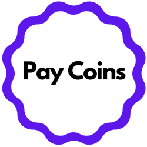

<p align="center">
    
</p>

# Paycoins Nodejs Library


## Paycoins Services exposed by the library

- Get Invoice
- Get Invoice Details
- Create Invoice
- Payment to Business Wallet(Checkout Payment Implementation)
- Withrawal from Business Wallet

## How to use

`npm install payoins-node`

You can get your PUBLICK_KEY and SECRET_KEY from the Paycoins dashboard.

```
const Paycoins = require('paycoins-node');

const paycoins = new Paycoins(PUBLICK_KEY, SECRET_KEY);
```

### Invoice

### `.getInvoice()`

This allows you to get a single paycoins invoice with it's ID

```javascript
const Paycoins = require("paycoins-node");

const paycoins = new Paycoins(PUBLIC_KEY, PRIVATE_KEY);

const getInvoice = async () => {
  try {
    const payload = {
      id: "535535574f5467774d546b784e6a49784d546b354d6a4d334e546731",
    };
    const response = await paycoins.Invoice.getInvoice(payload);
    console.log(response);
  } catch (error) {
    console.log(error);
  }
};
```

#### Returns

A sample response is:

```javascript
{
    "data":{
        "inv_reference":"INV980191621199237585","redirect_url":"http://localhost:9000/invoice/","status":-1,
        "final_amount":0,
        "amount":200,
        "amount_remain":0,
        "currency":"NG",
        "usd_equivalent":2.25,
        "available_currencies":[
            {
                "currency":"BTC",
                "name":"Bitcoin",
                "icon":"jhfed efhhef","address":"326aNdz1QWkGehkXGrmXcPdZZ5Qr79tczJ",
                "amount":0.000068,
                "exchange_rate":2941712.81
            },
            {"
            currency":"ETH",
            "name":"Ethereum",
            "icon":null,"address":"0x26853E025F40A383C0644d61374155dd785E3254",
            "amount":0.001108,
            "exchange_rate":180459.43
            },
            {
                "currency":"XRP",
                "name":"XRP",
                "icon":null,"address":"rw2ciyaNshpHe7bCHo4bRWq6pqqynnWKQg:::ucl:::1752739073",
                "amount":3.603131,
                "exchange_rate":55.51
            }
        ],
        "customer_details":{
            "customer_email":"taiwo@gmail.com","customer_firstname":"Taiwo","customer_lastname":"Enoch",
            "customer_phone":null
        },
        "business_details":{
            "name":"Agape Businesses","email":"adesinasamueloluwaseun@gmail.com"
        },
        "customizations":{
            "title":"Sale",
            "description":null,
            "logo":null
        },
        "payment_link":"https://paycoins-checkout.netlify.app/checkout/535535574f5467774d546b784e6a49784d546b354d6a4d334e546731"},"
        error":false,
        "message":"Invoice Details Fetched"
}
```

### `.getInvoiceDetails()`

This allow you to get a single invoice full details

```javascript
const Paycoins = require("paycoins-node");

const paycoins = new Paycoins(PUBLIC_KEY, PRIVATE_KEY);

const getInvoiceDetails = async () => {
  try {
    const payload = {
      id: "INV1608644446774",
    };
    const response = await paycoins.Invoice.getInvoiceDetails(payload);
    console.log(response);
  } catch (error) {
    console.log(error);
  }
};
```

#### Returns

```javascript
{
    "data":{
        "reference":"INV1608644446774",
        "status":"paid",
        "amount":2000,
        "currency":"NGN",
        "usd_equivalent":4.87,
        "available_currencies":[
            {
                "currency":"BTC",
                "name":"Bitcoin",
                "icon":"jhfed efhhef","address":"34G94bqB1awozqaE1vnraHxn1LnL9gcrGu","amount":0.000147,
                "exchange_rate":13609091.59
            },
            {
                "currency":"ETH",
                "name":"Ethereum",
                "icon":null,"address":"0xfCe39aCA85ef4B7C2dC4a118Cbcc9aCcd8C4cF79",
                "amount":0.002398,
                "exchange_rate":833921.06
            },
            {
                "currency":"XRP",
                "name":"XRP",
                "icon":null,"address":"rw2ciyaNshpHe7bCHo4bRWq6pqqynnWKQg:::ucl:::3982814913",
                "amount":7.788506,
                "exchange_rate":256.79
            }
        ],
        "customer_details":{
            "customer_email":"adesinasamueloluwaseun@gmail.com",
            "customer_firstname":"adesina",
            "customer_lastname":"samuel",
            "customer_phone":null
        },
        "business_details":{
            "name":"Agape Businesses",
            "email":"adesinasamueloluwaseun@gmail.com"
        },
        "customizations":{
            "title":"Sales",
            "description":null,
            "logo":null
        },
        "payments":[],
        "payment_link":"https://paycoins-checkout.netlify.app/checkout/535535574d6a49324e4459784e6a41344e6a51304e4451324e7a6331"},"error":false,
        "message":"Invoice Details Fetched"
}
```
### `.getAllInvoices()`

This allow you to get all list of available invoices in your wallet

```javascript
const Paycoins = require("paycoins-node");

const paycoins = new Paycoins(PUBLIC_KEY, PRIVATE_KEY);

const getAllInvoices = async () => {
  try {
    const response = await paycoins.Invoice.getAllInvoices();
    console.log(response);
  } catch (error) {
    console.log(error);
  }
};
```
### `.createInvoice()`

This allow you to initiate an invoice for payment

```javascript
const Paycoins = require("paycoins-node");

const paycoins = new Paycoins(PUBLIC_KEY, PRIVATE_KEY);

const createInvoice = async () => {
  try {
    const payload = {
      amount: 1000,
      currency: "NGN",
      redirect_url: "https://bcoin.com",
      customer: {
        firstname: "sdk",
        lastname: "node",
        email: "sdknodesetup@example.com",
      },
      customization: {
        title: "Sales",
      },
    };
    const response = await paycoins.Invoice.createInvoice(payload);
    console.log(response);
  } catch (error) {
    console.log(error);
  }
};
```

#### Returns

```javascript
{
  data: {
    reference: 'INV1626108108916',
    payment_link: 'https://paycoins-checkout.netlify.app/checkout/535535574d7a6b334e6a4d784e6a49324d5441344d5441344f544532'
  },
  error: false,
  message: 'Invoice Created'
}
```

### `.payout()`

This allow you to make trigger a payout/withdrawal function from your business wallet

```javascript
const Paycoins = require("paycoins-node");

const paycoins = new Paycoins(PUBLIC_KEY, PRIVATE_KEY);

const payout = async () => {
  try {
    const payload = {
      amount: 0.001,
      address: "1KFzzGtDdnq5hrwxXGjwVnKzRbvf8WVxck",
      business_id: "4d54413d",
      wallet_id: "4d7a673d",
    };
    const response = await paycoins.Invoice.payout(payload);
    console.log(response);
  } catch (error) {
    console.log(error);
  }
};
```

#### Returns

```javascript
{
  "data": {
    "amount": 0.001,
    "currency": "BTC",
    "created_at": "2015-01-31T20:49:02Z",
    "address": "1KFzzGtDdnq5hrwxXGjwVnKzRbvf8WVxck",
    "status": "pending"
  },
  "error": false,
  "message": "Your payuout is pending"
}
```

### `.checkoutout()`

Thi allow you accept payment into your business wallet through checkout

```javascript
const Paycoins = require("paycoins-node");

const paycoins = new Paycoins(PUBLIC_KEY, PRIVATE_KEY);

const checkoutout = async () => {
  try {
    const payload = {
      amount: 0.002,
      address: "3GrCNuSg7825c2MssG8ZLwuZYuffuPsm8K",
    };
    const response = await paycoins.Invoice.checkout(payload);
    console.log(response);
  } catch (error) {
    console.log(error);
  }
};
```

#### Returns

```javascript
{
  data: {
    amount: 0.002,
    currency: 'BTC',
    delivery_attempts: 0,
    created_at: '2015-01-31T20:49:02Z',
    transaction_id: 465,
    expected_amount: 0,
    amount_paid: 512756.44999999995,
    amount_remain: -512756.45,
    group: '535535574e7a59314d4467784e6a41344e6a51784d4441784f546b77',
    wallet_id: '4d7a673d'
  },
  error: false,
  message: 'New payment made'
}
```
